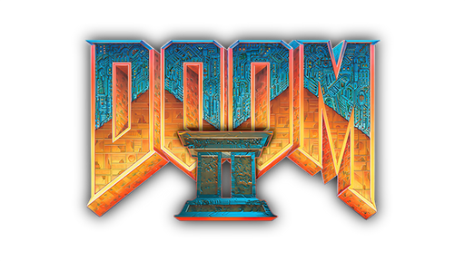
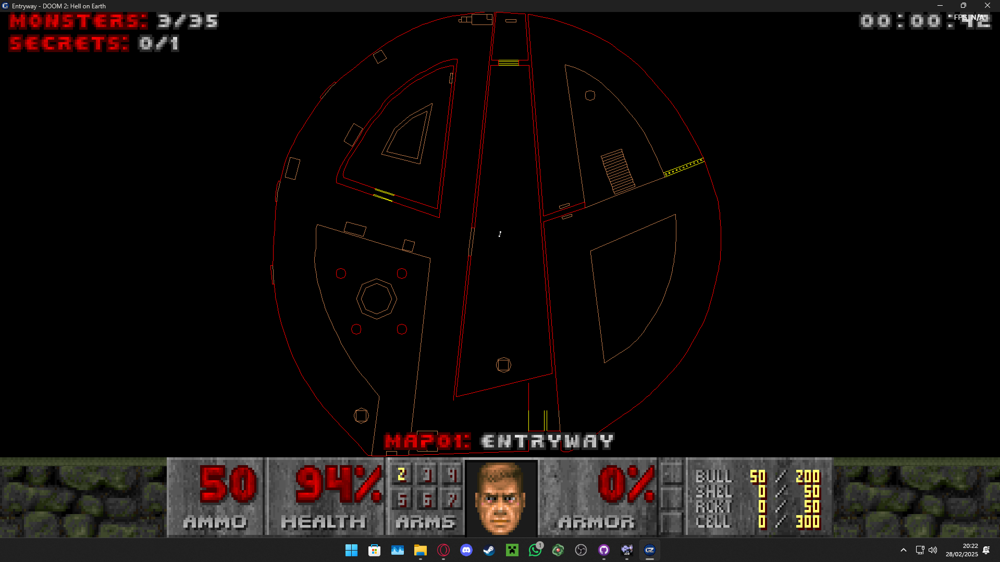
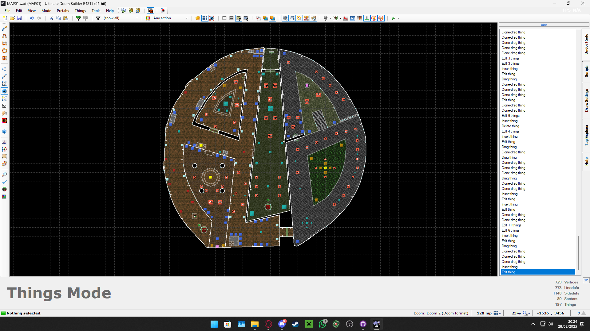
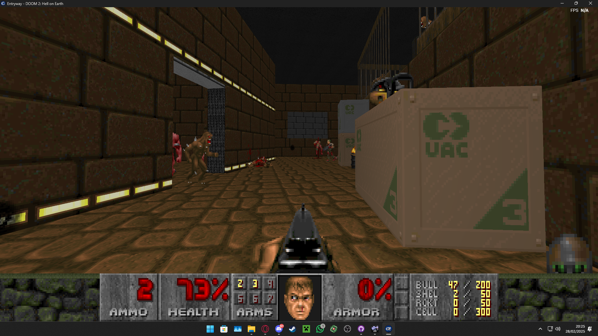
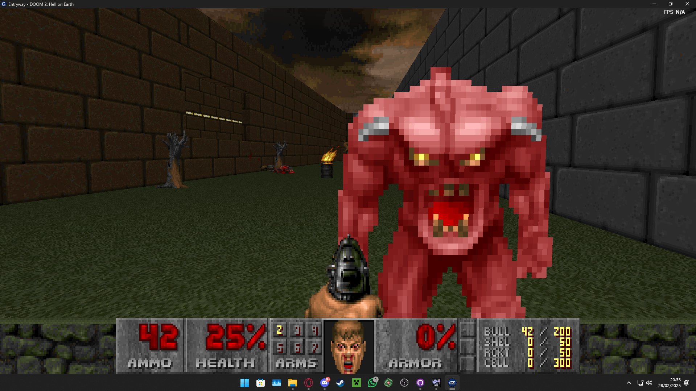

# ALB Doom Mod
### ¿Qué es un mod de Doom?

Un mod de `Doom` es una modificación de los archivos del juego. Nuestro mod modifica el primer nivel (MAP01), en específico es un nivel original inspirado en el logo del instituto IES Ana Luisa Benítez.

### Estructura del Repositorio
El repositorio se organiza en las siguientes carpetas y archivos principales:
- **map**  
  Contiene el MAP01.wad con sus modificaciones temporales. **El mod ALB** está situada en el otro directorio llamado _DEFINITIVE EDITION_.
- **img**  
  Incluyen los mapas conceptuales del mod. La estructura y organización de las diferentes secciones.

> [!NOTE]
> **El mod de la carpeta _map_ está incompleto**. El archivo estable es el mapa (ALBMAP.wad) que se encuentra en la carpeta `DEFINITIVE EDITION`.

### Requisitos

- **GZDOOM**: Es el _source port_ para ejecutar el wad de Doom II. Disponible en [su página oficial](https://zdoom.org/downloads).

- **ZDL**: Para implementar el mod en GZDOOM. Lo puedes [descargar aquí](https://www.moddb.com/mods/brutal-doom/downloads/zdl-final-fixed-version).

- **El juego original**. Necesitas el archivo wad de Steam del juego Doom II.

## Capturas del juego

#### Créditos
- **Autor:** [@masdlave](https://github.com/masdlave) | Maria Salazar
- [Vitexus1](https://github.com/Vitexus1) | Diego López de la Llave
- [Ultimate Doom Builder](https://ultimatedoombuilder.github.io/)
